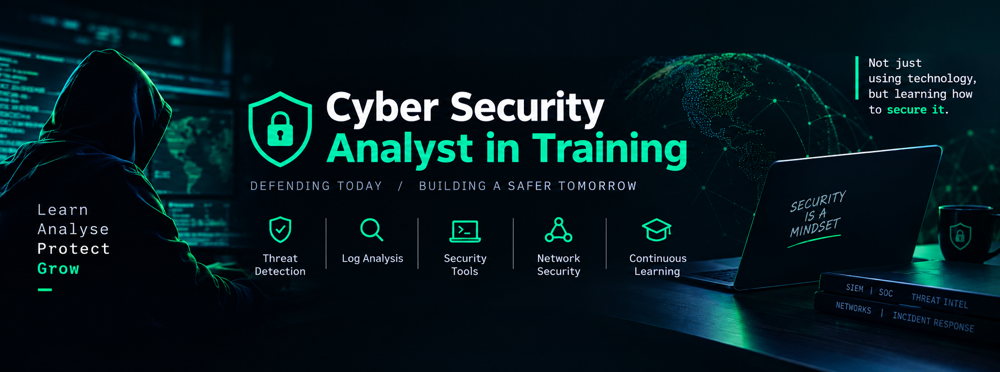

!--
  GitHub Profile README
  Repository: cloud-hacker01/cloud-hacker01
-->

<p align="center">
  
</p>

<h1 align="center">Hi, I'm Austine Chinemerem 👋</h1>

<p align="center">
  <strong>Cyber Security Analyst in Training</strong> • Security-minded technologist • Continuous learner
</p>

<p align="center">
  <a href="https://github.com/cloud-hacker01">
    
  </a>
  
  
  
</p>

---

## 🛡️ About Me

I'm building my career in **cybersecurity**, with a growing focus on defensive security, security operations, monitoring, investigation, and practical hands-on learning.

I enjoy understanding how systems work, identifying weaknesses, analysing suspicious activity, and turning what I learn into practical projects.

> **Security is not just about tools — it's about understanding systems, recognising risk, and protecting what matters.**

### 🎯 Current Direction

- 🔐 Cyber Security Analysis
- 🖥️ Security Operations / SOC fundamentals
- 📊 Log analysis and security monitoring
- 🚨 Threat detection and incident response fundamentals
- 🌐 Networking and network security
- 🧰 Security tools and practical labs
- 🐍 Python and scripting for security automation
- 📚 Continuous security learning

---

## ⚙️ Profile Specifications

<p align="center">
  
</p>

<p align="center">
  
</p>

---

## 🧰 Technology & Security Stack

### Security

<p>
  
  
  
  
  
</p>

### Development & Tools

<p>
  
  
  
  
  
  
</p>

---

## 📈 GitHub Activity

<p align="center">
  
  
</p>

> The statistics cards above are SVG-based and update from public GitHub activity.

---

## 🔬 What I'm Building

I use this profile repository as a place to document my development and cybersecurity journey.

| Area | What you'll find |
|---|---|
| 🔐 Cybersecurity | Security labs, notes, investigations and defensive projects |
| 🧪 Practical Labs | Hands-on exercises and security experiments |
| 🐍 Python | Scripts and small tools for automation and analysis |
| 🌐 Networking | Networking concepts, troubleshooting and security |
| 📊 Analysis | Logs, indicators, patterns and investigation notes |
| 📚 Learning | Study notes, resources and lessons learned |

---

## 🧠 Learning Roadmap

```text
Cybersecurity Foundations
        │
        ├── Networking & Protocols
        │
        ├── Linux & System Administration
        │
        ├── Security Monitoring
        │
        ├── SIEM & Log Analysis
        │
        ├── Threat Detection
        │
        ├── Incident Response
        │
        └── Security Automation with Python
```

---

## 🚀 Featured Goals

- Build a strong foundation in defensive cybersecurity
- Develop practical SOC analyst skills
- Become comfortable investigating security alerts
- Improve Linux, networking and scripting skills
- Build useful security automation projects
- Document the learning process publicly
- Keep improving through hands-on labs and real-world scenarios

---

## 📂 Repository Structure

```text
cloud-hacker01/
├── README.md
├── assets/
│   ├── profile-specs.svg
│   └── security-focus.svg
└── projects/
    └── ...
```

---

## 🤝 Let's Connect

I'm open to connecting with other developers, cybersecurity learners, analysts, and technology professionals.

<p align="center">
  <a href="https://github.com/cloud-hacker01">
    
  </a>
</p>

---

<p align="center">
  <strong>Learn • Analyse • Protect • Grow</strong>
</p>

<p align="center">
  <sub>Building security skills one lab, log, alert and project at a time.</sub>
</p>
